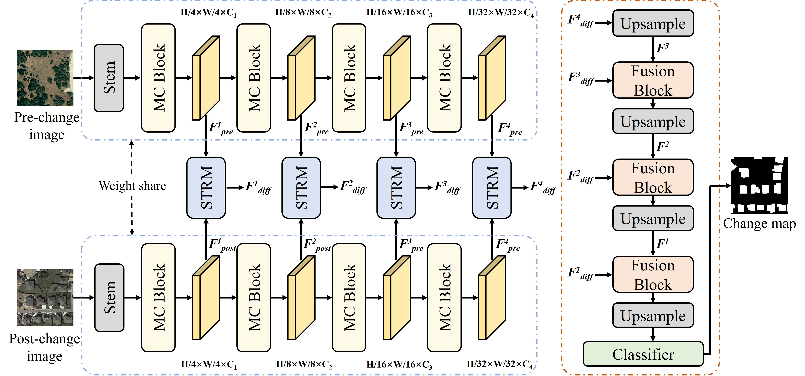
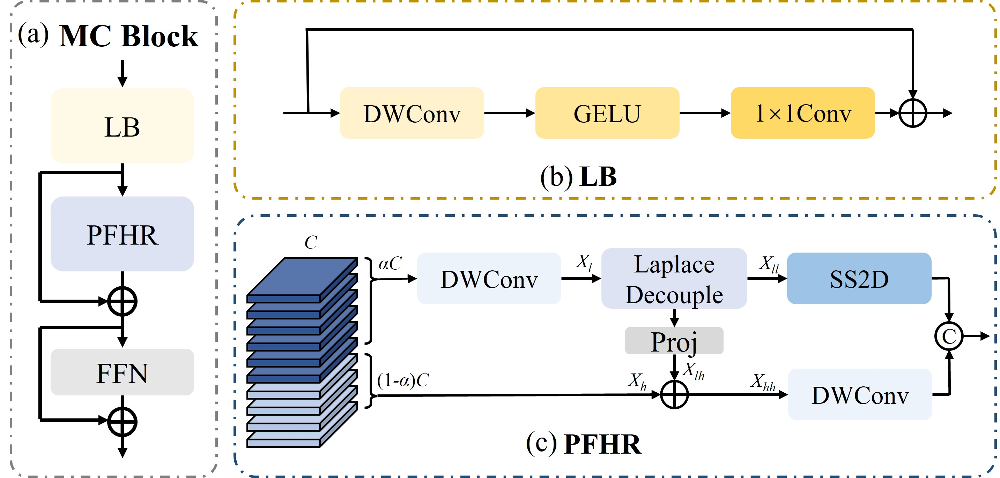
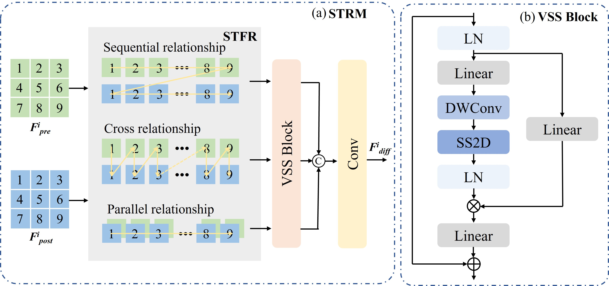

<div align="center">
 
# HCMCNet
**HCMCNet: Progressive Global-Local Fusion for Fine-Grained Remote Sensing Change Detection**

> 👥 **Authors**：Dongsheng Liu, Yuan Cao, Jie Han\* 

> 📖 **Journal**：Nuerocomputing

Nanjing University of Information Science and Technology, Nanjin, Jiangsu Province, China

[[Paper Link]] 
</div>

---


## 🚀 Overview


* [**HCMCNet**]() serves as an efficient and state-of-the-art (SOTA) benchmark for binary change detection.


### Overall Framework
<p align="center">
  


### MambaConv Encoder
<p align="center">
  


### STRM
<p align="center">
  

---


## 📦 Requirements
The environment configuration can be set up following the guidelines provided by [ChangeMamba](https://github.com/ChenHongruixuan/ChangeMamba) and [TinyViM](https://github.com/xwmaxwma/TinyViM?utm_source=catalyzex.com).


---

## 📁 Dataset Preparation

This project supports three main change detection datasets:
- **LEVIR-CD** - [Download](https://www.kaggle.com/datasets/mdrifaturrahman33/levir-cd-change-detection)
- **SYSU-CD** - [Download](https://github.com/liumency/SYSU-CD)
- **WHU-CD** - [Download](http://gpcv.whu.edu.cn/data/building_dataset.html)
- **DSIFN-CD** - [Download](https://opendatalab.com/OpenDataLab/DSIFN-CD)

---

### Dataset Structure

```
your_dataset/
│   ├── A/          # Pre-change images
│   ├── B/          # Post-change images
│   └── label/      # Ground truth masks
│   ├── train.txt          
│   ├── test.txt         
│   └── val.txt     
```

---

## 🚂 Training

```bash
python train.py \
    --dataset_name levir \
    --root_folder /path/to/LEVIR-CD/train \
    --batch_size 16 \
    --epochs 100 \
    --lr 0.0001
```

---

## ⚙️ Arguments

### Required Arguments

| Argument | Description | Example |
|----------|-------------|---------|
| `--dataset_name` | Dataset type: `levir`, `sysu`, `dsifn` or `whu` | `--dataset_name levir` |
| `--root_folder` | Path to  data | `--path /data/train` |


### Optional Arguments

| Argument | Default | Description |
|----------|---------|-------------|
| `--batch_size` | 16 | Batch size for training |
| `--epochs` | 100 | Number of training epochs |
| `--lr` | 0.0001 | Learning rate |
| `--warm_up_epoch` | 1 | warm up epoch |
| `--seed` | 3407 | Random seed for reproducibility |
| `--num_workers` | 4 | Number of data loading workers |

---

## 🔧 Advanced Usage Examples

### Custom Save Directory and Model Name
```bash
python train.py \
    --dataset levir \
    --root_folder /data/LEVIR-CD/train \
    --epochs 100
```

### Different Learning Rate Schedule
```bash
python train.py \
    --dataset sysu \
    --root_folder /data/SYSU-CD/train \
    --lr 0.0005 \
    --epochs 150
```

### Smaller Batch Size (for limited GPU memory)
```bash
python train.py \
    --dataset levir \
    --root_folder /data/train \
    --batch_size 16 \
    --num_workers 2
```

---


## 📧 Contact

If you have any questions, please contact Yuan Cao at 202412640321@nuist.edu.cn

---
